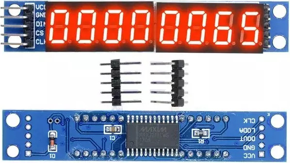

# Display 7 Segmentos 8 Dígitos MAX7219

## Interfaces

Pino | Descrição
---- | ---------
VCC  | 5V
GND  | Ground
DIN  | Data Input
CS   | Chip Select
CLK  | Clock

## Conexão
Módulo | Arduino
------ | ---------
VCC    | 5V
GND    | GND
DIN    | D5
CS     | D6
CLK    | D7

## Bibliotecas
- **[LedControl](http://wayoda.github.io/LedControl/)** by **Eberhard Fahle** ([Documentação](../../../wiki/LedControl-by-Eberhard-Fahle))
