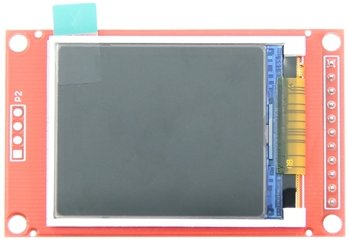
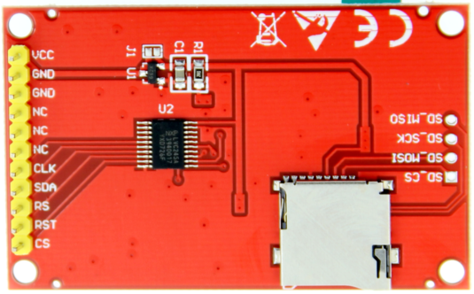

# Display LCD TFT 1.8" (128x160)

## Interfaces

### LCD
Pino | Descrição
---- | ---------
VCC  | 3.3V~5V
GND  | Ground
GND  | Ground
NC   | No Connect
NC   | No Connect
NC   | No Connect
CLK  | Clock
SDA  | Serial Data
RS   | Register Selection
RST  | Reset
CS   | Chip Select

### SDCard
Pino    | Descrição
------- | ---------
SD_CS   | Chip Select
SD_MOSI | Data input MOSI
SD_CLK  | Clock
SD_MISO | Data output MISO

## Bibliotecas
- **[Adafruit ST7735 and ST7789 Library](https://github.com/adafruit/Adafruit-ST7735-Library)** by **Adafruit** ([Documentação](../../../wiki/Adafruit-ST7735-and-ST7789-Library-by-Adafruit))
