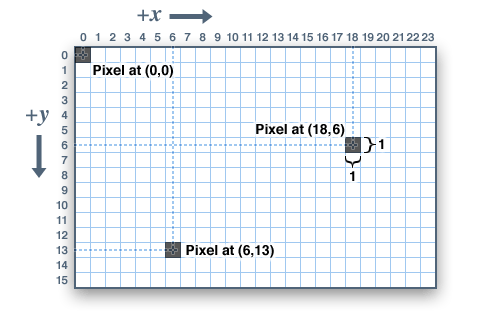
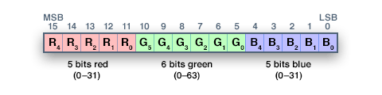
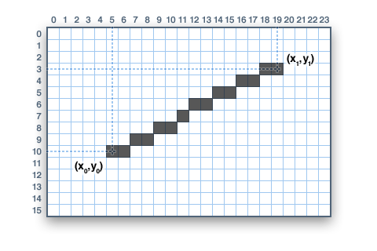
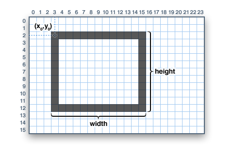
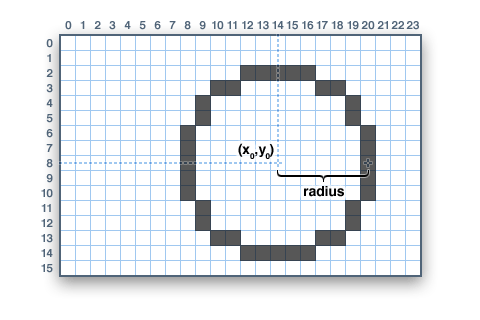
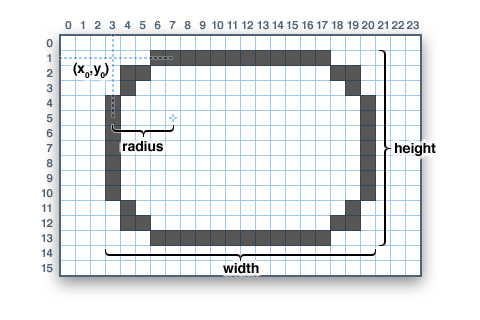
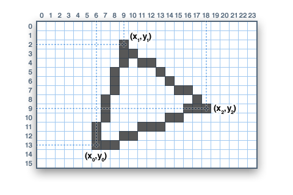
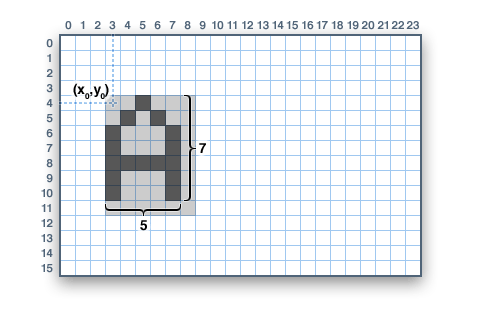

# Display LCD TFT 1.8" (128x160)


## Interfaces


### LCD
Pino | Descrição
---- | ---------
VCC  | 3.3V~5V
GND  | Ground
GND  | Ground
NC   | No Connect
NC   | No Connect
NC   | No Connect
CLK  | Clock
SDA  | Serial Data
RS   | Register Selection
RST  | Reset
CS   | Chip Select

### SDCard
Pino    | Descrição
------- | ---------
SD_CS   | Chip Select
SD_MOSI | Data input MOSI
SD_CLK  | Clock
SD_MISO | Data output MISO

## Bibliotecas
- **[Adafruit ST7735 and ST7789 Library](https://github.com/adafruit/Adafruit-ST7735-Library)** by **Adafruit**

### Adafruit ST7735
#### Sistema de Coordenadas
Os blocos que constituem uma imagem digital são endereçados por suas coordenadas horizontal (X) e vertical (Y). O sistema de coordenadas coloca a origem (0,0) no canto superior esquerdo, com X positivo aumentando para a direita e Y positivo aumentando para baixo.



As coordenadas são sempre expressas em unidades de pixel. Não há escala implícita para uma medida do mundo real, como milímetros ou polegadas. Se você está buscando uma escala do mundo real, precisará dimensionar suas coordenadas para se adequar. O espaçamento dos pontos pode ser encontrado medindo a largura da tela e dividindo o número de pixels por esta medida.

Para telas coloridas, as cores são representadas como valores de 16 bits. Algumas telas podem ser fisicamente capazes de mais ou menos bits do que isso, mas a biblioteca opera com valores de 16 bits (sem sinal). Eles são fáceis para o Arduino trabalhar, enquanto também fornecem um tipo de dados consistente em todos os diferentes monitores. Os componentes de cor primária - vermelho, verde e azul - são todos "compactados" em uma única variável de 16 bits, com os 5 bits mais significativos transmitindo vermelho, 6 bits intermediários transmitindo verde e os 5 bits menos significativos transmitindo azul. Essa parte extra é atribuída ao verde porque nossos olhos são mais sensíveis à luz verde.



Para as cores primárias e secundárias mais comuns, temos estas constantes que você pode incluir em seu próprio código. Claro, você pode escolher qualquer uma das 65.536 cores diferentes, mas esta lista básica pode ser mais fácil ao começar:

CONSTANTE      | HEX
-------------- | ------
ST77XX_BLACK   | 0x0000
ST77XX_BLUE    | 0x001F
ST77XX_RED     | 0xF800
ST77XX_GREEN   | 0x07E0
ST77XX_CYAN    | 0x07FF
ST77XX_MAGENTA | 0xF81F
ST77XX_YELLOW  | 0xFFE0
ST77XX_WHITE   | 0xFFFF

#### Funções
##### Desenho de pixels (pontos)
```
void drawPixel(uint16_t x, uint16_t y, uint16_t cor);
```

##### Desenho de linhas
```
void drawLine(uint16_t x0, uint16_t y0, uint16_t x1, uint16_t y1, uint16_t cor);
```


Para linhas horizontais ou verticais, existem funções de desenho de linha otimizadas que evitam os cálculos angulares:
```
void drawFastVLine(uint16_t x, uint16_t y, uint16_t comprimento, uint16_t cor);
```
```
void drawFastHLine(uint8_t x, uint8_t y, uint8_t comprimento, uint16_t cor);
```

##### Retângulos
Retângulos e quadrados podem ser desenhados e preenchidos usando os procedimentos a seguir. Cada um aceita um par de **X**,**Y** para o canto superior esquerdo do retângulo, uma **largura**, uma **altura** e uma **cor**. 
A função ```drawRect()``` renderiza apenas o quadro (contorno) do retângulo - o interior não é afetado - enquanto ```fillRect()``` preenche toda a área com uma determinada cor:
```
void drawRect(uint16_t x, uint16_t y, uint16_t largura, uint16_t altura, uint16_t cor);
```
```
void fillRect(uint16_t x, uint16_t y, uint16_t largura, uint16_t altura, uint16_t cor);
```



##### Círculos
Da mesma forma, para círculos, você pode desenhar e preencher. Cada função aceita um par **X**,**Y** para o ponto central, um **raio** em pixels e uma **cor**:
```
void drawCircle(uint16_t x, uint16_t y, uint16_t raio, uint16_t cor);
```
```
void fillCircle(uint16_t x, uint16_t y, uint16_t raio, uint16_t cor);
```



##### Retângulos arredondados
Para retângulos com cantos arredondados, as funções de desenho e preenchimento estão novamente disponíveis. Cada um começa com um **X**, **Y**, **largura** e **altura** (assim como retângulos normais), então há um **raio** de canto (em pixels) e finalmente o valor da **cor**:
```
void drawRoundRect(uint16_t x, uint16_t y, uint16_t largura, uint16_t altura, uint16_t raio, uint16_t cor);
```
```
void fillRoundRect(uint16_t x, uint16_t y, uint16_t largura, uint16_t altura, uint16_t raio, uint16_t cor);
```


##### Triângulos
Com os triângulos, mais uma vez, existem as funções desenhar e preencher. Cada um requer sete parâmetros completos: as coordenadas **X** e **Y** para **três pontos** de canto que definem o triângulo, seguidas por uma **cor**:
```
void drawTriangle(uint16_t x0, uint16_t y0, uint16_t x1, uint16_t y1, uint16_t x2, uint16_t y2, uint16_t cor);
```
```
void fillTriangle(uint16_t x0, uint16_t y0, uint16_t x1, uint16_t y1, uint16_t x2, uint16_t y2, uint16_t cor);
```


##### Caracteres e Texto
Existem dois procedimentos básicos de desenho de strings para adicionar texto. O primeiro é apenas para um único caractere. Você pode colocar este caractere em qualquer local e com qualquer cor. Há apenas uma fonte (para economizar espaço) e deve ter 5x8 pixels, mas um parâmetro opcional de tamanho pode ser passado, o que dimensiona a fonte por esse fator (por exemplo, tamanho = 2 renderizará o texto em 10x16 pixels por caractere). É um pouco limitado, mas ter apenas uma única fonte ajuda a manter o programa com um tamanho pequeno.
```
void drawChar(uint16_t x, uint16_t y, char caractere, uint16_t cor, uint16_t cordefundo, uint8_t tamanho);
```



O texto é muito flexível, mas funciona de maneira um pouco diferente. Em vez de um procedimento, o **tamanho**, a **cor** e a **posição** do texto são configurados em funções separadas e, em seguida, a função ```print()``` é usada - isso torna mais fácil e fornece todas as mesmas capacidades de formatação de string e número da familiar função ```Serial.print()```!
```
void setCursor(uint16_t x, uint16_t y);
void setTextColor(uint16_t cor);
void setTextColor(uint16_t cor, uint16_t cordefundo);
void setTextSize(uint8_t tamanho);
void setTextWrap(boolean quebrar);
```

Comece com ```setCursor(x, y)```, que colocará o canto superior esquerdo do texto onde desejar. Inicialmente, isso é definido como (0,0) (o canto superior esquerdo da tela). Em seguida, defina a cor do texto com ```setTextColor(cor)``` - por padrão, é branco. O texto é normalmente desenhado "claro" - as partes abertas de cada caractere mostram o conteúdo do fundo original, mas se você quiser que o texto bloqueie o que está por baixo, uma cor de fundo pode ser especificada como um segundo parâmetro opcional ```setTextColor()```. Finalmente, ```setTextSize(tamanho)``` multiplicará a escala do texto por um determinado fator inteiro.

Depois de configurar tudo, você pode usar ```print()``` ou ```println()``` - exatamente como você faz com a impressão serial! Por exemplo, para imprimir a string, use ```print("Olá mundo")```. Você também pode usar ```print()``` para números e variáveis - por exemplo: ```print(1234.56)``` e ```print(0xDEADBEEF, HEX)```.

Por padrão, longas linhas de texto são definidas para "quebrar" automaticamente de volta para a coluna mais à esquerda. Para substituir esse comportamento  (para que o texto saia do lado direito da tela - útil para efeitos de letreiro de rolagem), use ```setTextWrap(false)```. O comportamento normal da quebra é restaurado com ```setTextWrap(true)```.

##### Bitmaps
Você pode desenhar pequenos bitmaps monocromáticos (cor única), bons para sprites e outras mini-animações ou ícones:
```
void drawBitmap(int16_t x, int16_t y, uint8_t *bitmap, int16_t l, int16_t a, uint16_t cor);
```

Isso emite um bloco contíguo de bits para a tela, onde cada bit "1" define o pixel correspondente para "cor", enquanto cada bit "0" é ignorado. **x**, **y** é o canto superior esquerdo onde o bitmap é desenhado, **l**, **a** são a largura e a altura em pixels.

Os dados de bitmap devem estar localizados na memória do programa usando a diretiva PROGMEM. Esta é uma função um tanto avançada e é melhor que os iniciantes voltem a ela mais tarde. Para obter uma introdução, consulte o tutorial do Arduino sobre o uso do [PROGMEM](https://www.arduino.cc/reference/pt/language/variables/utilities/progmem/).

Aqui está uma ferramenta online útil para gerar bitmap: http://javl.github.io/image2cpp/

##### Limpar ou preencher a tela
A função ```fillScreen()``` definirá a exibição inteira para uma determinada cor, apagando qualquer conteúdo existente:
```
void fillScreen(uint16_t cor);
```

##### Girando a tela
Você também pode girar seu desenho. Observe que isso não girará o que você já desenhou, mas mudará o sistema de coordenadas para qualquer novo desenho. Isso pode ser muito útil se você tiver que virar a placa ou a tela de lado ou de cabeça para baixo para caber em um gabinete específico. Na maioria dos casos, isso só precisa ser feito uma vez, dentro de ```setup()```.

Só podemos girar 0, 90, 180 ou 270 graus - qualquer outra coisa não é possível no hardware e é muito difícil para um Arduino calcular no software.
```
void setRotation(uint8_t rotacao);
```

O parâmetro de rotação pode ser 0, 1, 2 ou 3. Para visores que fazem parte de um Arduino shield, o valor de rotação 0 define o visor no modo retrato (alto), com o conector USB no canto superior direito. O valor de rotação 2 também é um modo retrato, com o conector USB no canto inferior esquerdo. A rotação 1 é o modo paisagem (amplo), com o conector USB no canto inferior direito, enquanto a rotação 3 também é paisagem, mas com o conector USB no canto superior esquerdo.

Para outras telas, tente todas as 4 rotações para descobrir como elas acabam girando, já que o alinhamento varia dependendo de cada tela, em geral as rotações se movem no sentido anti-horário.

Ao girar, o ponto de origem (0,0) muda - a ideia é que ele deve ser organizado no canto superior esquerdo da tela para as outras funções gráficas para fazer sentido consistente (e corresponder a todas as descrições de função acima).

Se você precisar fazer referência ao tamanho da tela (que mudará entre os modos retrato e paisagem), use ```width()``` e ```height()```.
```
uint16_t width();
```
```
uint16_t height();
```

Cada um retorna a dimensão (em pixels) do eixo correspondente, ajustada para a configuração de rotação atual da tela.