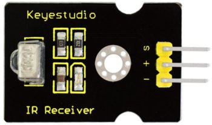
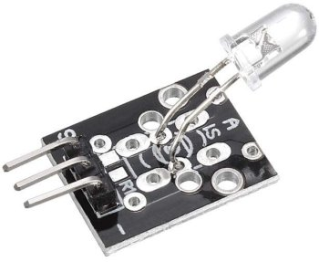

# Infravermelho

## Receptor


### Interfaces

Pino | Descrição
---- | ---------
S    | Serial data
```+``` | 5V
```-``` | Ground

### Conexão

Módulo | Arduino
------ | ---------
S      | D3
```+``` | 5V
```-```  | GND

## Transmissor



### Interfaces

Pino | Descrição
---- | ---------
S    | Serial data
```+``` | 5V
```-``` | Ground

### Conexão

Módulo | Arduino
------ | ---------
S      | D4
```+``` | 5V
```-```  | GND


## Bibliotecas
- **[IRMP](https://github.com/ukw100/IRMP)** by **Frank Meyer, Armin Joachimsmeyer**
