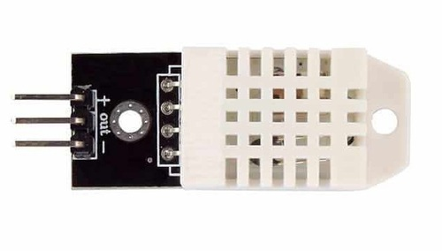

# Sensor de Umidade e Temperatura DHT22 / AM2302

## Interfaces

Pino | Descrição
---- | ---------
+    | 3.3V~5V
OUT  | Serial data
-    | Ground

## Conexão
Módulo | Arduino
------ | ---------
+      | 5V
OUT    | D7
-      | GND

## Bibliotecas
- **[DHT sensor library](https://github.com/adafruit/DHT-sensor-library)** by **Adafruit** ([Documentação](../../../wiki/DHT-sensor-library-by-Adafruit))
